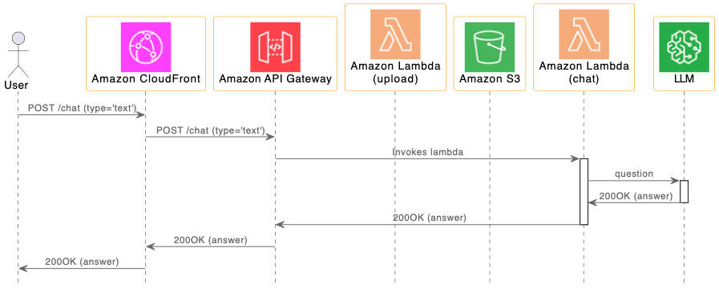
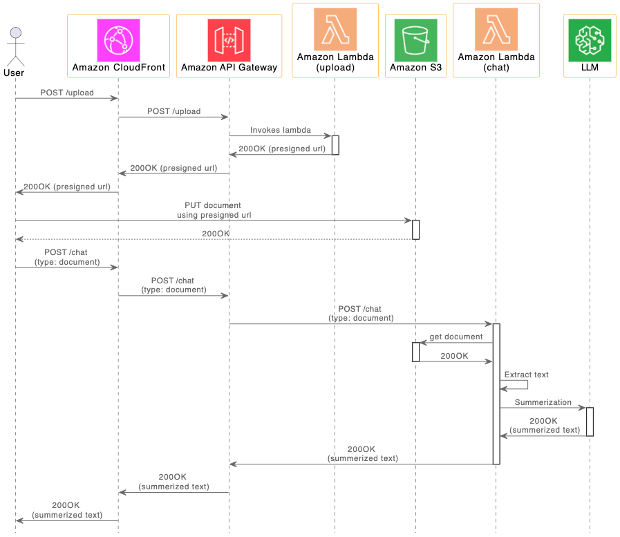

# Amazon Bedrock의 LLM을 이용한 Simple Chatbot 만들기

여기서는 Amazon Bedrock의 LLM(Large language Model)을 이용하여 Prompt에 기반한 간단한 질문/답변을 보여주는 simple chatbot을 구현합니다. 브라우저에서 chatbot으로 메시지를 전송하면, LLM을 통해 답변을 얻고 이를 화면에 보여줍니다. 입력한 모든 내용은 DynamoDB에 call log로 저장됩니다. 또한 파일 버튼을 선택하여, TXT, PDF, CSV와 같은 문서 파일을 Amazon S3로 업로드하고, 텍스트를 추출하여 문서 요약(Summerization) 기능을 사용할 수 있습니다.

LLM 어플리케이션 개발을 위해 LangChain을 활용하였으며, Bedrock이 제공하는 LLM 모델을 확인하고, 필요시 변경할 수 있습니다. Chatbot API를 테스트 하기 위하여 Web Client를 제공합니다. AWS CDK를 이용하여 chatbot을 위한 인프라를 설치하면, ouput 화면에서 브라우저로 접속할 수 있는 URL을 알수 있습니다. Bedrock은 아직 Preview로 제공되므로, AWS를 통해 Preview Access 권한을 획득하여야 사용할 수 있습니다.


채팅을 위한 call flow는 아래와 같습니다.

1) 사용자가 채팅창에서 질문(Question)을 입력합니다.
2) 이것은 Chat API를 이용하여 lambda (chat)에 전달됩니다.
3) lambda(chat)은 질문을 LLM에 전달합니다.
4) 답변을 받으면 사용자에게 결과를 전달합니다.



파일업로드 후에 문서 요약(Summerization)을 위한 call flow는 아래와 같습니다.

1) 사용자가 파일 업로드를 요청합니다. 이때 사용하는 Upload API는 lambda (upload)에 전달되어 S3 presigned url을 생성하게 됩니다.
2) 사용자가 presigned url로 문서를 업로드 하면 S3에 object로 저장됩니다.
3) Chat API에서 request type을 "document"로 지정하면 lambda (chat)는 S3에서 object를 로드하여 텍스트를 추출합니다.
4) 채팅창에 업로드한 문서의 요약(Summerization)을 보여지기 위해 summerization을 수행하고 그 결과를 사용자에게 전달합니다.




## Bedrock 모델 정보 가져오기

Bedrock은 완전관리형 서비스로 API를 이용하여 접속하며, 여기서는 "us-west-2"를 이용하여 아래의 endpoint_url로 접속합니다. 이 주소는 preview 권한을 받을때 안내 받을 수 있습니다. 아래와 같이 boto3.client()을 이용하여 client를 생성합니다. 이후 list_foundation_models()을 이용하여 현재 지원 가능한 LLM에 대한 정보를 획득할 수 있습니다.

```python
import boto3
from utils import bedrock

bedrock_region = "us-west-2" 
bedrock_config = {
    "region_name":bedrock_region,
    "endpoint_url":"https://prod.us-west-2.frontend.bedrock.aws.dev"
}
    
if accessType=='aws': # internal user of aws
    boto3_bedrock = boto3.client(
        service_name='bedrock’,
        region_name=bedrock_config["region_name"],
        endpoint_url=bedrock_config["endpoint_url"],
    )
else: # preview user
    boto3_bedrock = boto3.client(
        service_name='bedrock’,
        region_name=bedrock_config["region_name"],
    )

modelInfo = boto3_bedrock.list_foundation_models()
print('models: ', modelInfo)
```

## LangChain 

아래와 같이 model id와 Bedrock client를 이용하여 LangChain을 정의합니다.

```python
from langchain.llms.bedrock import Bedrock

modelId = 'amazon.titan-tg1-large'  # anthropic.claude-v1
parameters = {
    "maxTokenCount":512,
    "stopSequences":[],
    "temperature":0,
    "topP":0.9
}

llm = Bedrock(model_id=modelId, client=boto3_bedrock, model_kwargs=parameters)
```

## 질문/답변하기 (Prompt)

LangChang을 이용하여 아래와 같이 간단한 질문과 답변을 Prompt을 이용하여 구현할 수 있습니다. 아래에서 입력인 text prompt를 LangChain 인터페이스를 통해 요청하면 Bedrock의 LLM 모델을 통해 답변을 얻을 수 있습니다.

```python
llm(text)
```

## Conversation

채팅 이력(chat history)을 포함하여 대화를 할수 있게 하는 방식에는 [ConversationChain](https://api.python.langchain.com/en/latest/chains/langchain.chains.conversation.base.ConversationChain.html)을 이용하는 방법과 직접 [PromptTemplate](https://python.langchain.com/docs/modules/model_io/prompts/prompt_templates/)을 이용하는 방법이 있습니다. ConversationChain을 사용시 chat history를 Human/Assistanct로 지정하더라도 채팅중에 Human/AI로 전환되는 현상이 있어서(버그로 보임), PromptTemplate를 이용합니다.

### ConversationChain

[ConversationBufferMemory](https://python.langchain.com/docs/modules/memory/types/buffer)을 이용하여 conversation을 정의합니다.

```python
from langchain.chains import ConversationChain
from langchain.memory import ConversationBufferMemory
memory = ConversationBufferMemory()   # Human / AI
conversation = ConversationChain(
    llm=llm, verbose=True, memory=memory
)
```

아후 아래처럼 input인 text에 대해 대화(conversation)을 chat history를 포함하여 구현할 수 있습니다.

```python
msg = conversation.predict(input=text)
```

### PromptTemplate을 이용하여 직접 구현하는 방법

아래와 같이 human_prefix와 ai_prefix을 이용하여 chat_memory를 생성한 후에 chat history에서 일정 부분만을 이용하여 prompt에 사용할 대화 이력을 만든 후에 PromptTemplate을 이용해 template을 생성합니다. 새로운 대화 이력은 편의상 개행문자('\n')을 지우고, chat_memory에 아래와 같이 추가합니다.

```python
chat_memory = ConversationBufferMemory(human_prefix='Human', ai_prefix='Assistant')

msg = get_answer_using_chat_history(text, chat_memory)

storedMsg = str(msg).replace("\n"," ") 
chat_memory.save_context({"input": text}, {"output": storedMsg}) 

def get_answer_using_chat_history(query, chat_memory):  
    condense_template = """Using the following conversation, answer friendly for the newest question. If you don't know the answer, just say that you don't know, don't try to make up an answer. You will be acting as a thoughtful advisor.
    
    {chat_history}
    
    Human: {question}

    Assistant:"""
    CONDENSE_QUESTION_PROMPT = PromptTemplate.from_template(condense_template)
        
    # extract chat history
    chats = chat_memory.load_memory_variables({})
    chat_history_all = chats['history']
    print('chat_history_all: ', chat_history_all)

    # use last two chunks of chat history
    text_splitter = RecursiveCharacterTextSplitter(chunk_size=2000,chunk_overlap=0)
    texts = text_splitter.split_text(chat_history_all) 

    pages = len(texts)
    if pages >= 2:
        chat_history = f"{texts[pages-2]} {texts[pages-1]}"
    elif pages == 1:
        chat_history = texts[0]
    else:  # 0 page
        chat_history = ""
    print('chat_history:\n ', chat_history)

    # make a question using chat history
    if pages >= 1:
        result = llm(CONDENSE_QUESTION_PROMPT.format(question=query, chat_history=chat_history))
    else:
        result = llm(query)

    return result    
```


## 문서 요약하기 (Summerization)

### 파일 읽어오기

S3에서 아래와 같이 Object를 읽어옵니다.

```python
s3r = boto3.resource("s3")
doc = s3r.Object(s3_bucket, s3_prefix + '/' + s3_file_name)
```

pdf파일은 PyPDF2를 이용하여 S3에서 직접 읽어옵니다.

```python
import PyPDF2

contents = doc.get()['Body'].read()
reader = PyPDF2.PdfReader(BytesIO(contents))

raw_text = []
for page in reader.pages:
    raw_text.append(page.extract_text())
contents = '\n'.join(raw_text)    
```

파일 확장자가 txt이라면 body에서 추출하여 사용합니다.
```python
contents = doc.get()['Body'].read()
```

파일 확장자가 csv일 경우에 CSVLoader을 이용하여 읽어옵니다.

```python
from langchain.document_loaders import CSVLoader
body = doc.get()['Body'].read()
reader = csv.reader(body)
contents = CSVLoader(reader)
```

### 텍스트 나누기 

문서가 긴 경우에 token 크기를 고려하여 아래와 같이 chunk들로 분리합니다. 이후 Document를 이용하여 앞에 3개의 chunk를 문서로 만듧니다.

```python
from langchain.text_splitter import RecursiveCharacterTextSplitter
from langchain.docstore.document import Document

text_splitter = RecursiveCharacterTextSplitter(chunk_size = 1000, chunk_overlap = 0)
texts = text_splitter.split_text(new_contents)
print('texts[0]: ', texts[0])

docs = [
    Document(
        page_content = t
    ) for t in texts[: 3]
]
```

### Template를 이용하여 요약하기

Template를 정의하고 [load_summarize_chain](https://sj-langchain.readthedocs.io/en/latest/chains/langchain.chains.summarize.__init__.load_summarize_chain.html?highlight=load_summarize_chain)을 이용하여 summarization를 수행합니다.

```python
from langchain import PromptTemplate
from langchain.chains.summarize import load_summarize_chain

prompt_template = """Write a concise summary of the following:

{ text }
        
    CONCISE SUMMARY """

PROMPT = PromptTemplate(template = prompt_template, input_variables = ["text"])
chain = load_summarize_chain(llm, chain_type = "stuff", prompt = PROMPT)
summary = chain.run(docs)
print('summary: ', summary)

if summary == '':  # error notification
    summary = 'Fail to summarize the document. Try agan...'
    return summary
else:
    return summary
```


## IAM Role

Bedrock의 IAM Policy는 아래와 같습니다.

```java
{
    "Version": "2012-10-17",
    "Statement": [
        {
            "Action": [
                "bedrock:*"
            ],
            "Resource": "*",
            "Effect": "Allow",
            "Sid": "BedrockFullAccess"
        }
    ]
}
```

이때의 Trust relationship은 아래와 같습니다.

```java
{
    "Version": "2012-10-17",
    "Statement": [
        {
            "Effect": "Allow",
            "Principal": {
                "Service": "sagemaker.amazonaws.com"
            },
            "Action": "sts:AssumeRole"
        },
        {
            "Effect": "Allow",
            "Principal": {
                "Service": "bedrock.amazonaws.com"
            },
            "Action": "sts:AssumeRole"
        }
    ]
}
```

Lambda가 Bedrock에 대한 Role을 가지도록 아래와 같이 CDK에서 IAM Role을 생성할 수 있습니다.

```python
const roleLambda = new iam.Role(this, "api-role-lambda-chat", {
    roleName: "api-role-lambda-chat-for-bedrock",
    assumedBy: new iam.CompositePrincipal(
        new iam.ServicePrincipal("lambda.amazonaws.com"),
        new iam.ServicePrincipal("sagemaker.amazonaws.com"),
        new iam.ServicePrincipal("bedrock.amazonaws.com")
    )
});
roleLambda.addManagedPolicy({
    managedPolicyArn: 'arn:aws:iam::aws:policy/service-role/AWSLambdaBasicExecutionRole',
});

const SageMakerPolicy = new iam.PolicyStatement({  // policy statement for sagemaker
    actions: ['sagemaker:*'],
    resources: ['*'],
});
const BedrockPolicy = new iam.PolicyStatement({  // policy statement for sagemaker
    actions: ['bedrock:*'],
    resources: ['*'],
});
roleLambda.attachInlinePolicy( // add sagemaker policy
    new iam.Policy(this, 'sagemaker-policy-lambda-chat-bedrock', {
        statements: [SageMakerPolicy],
    }),
);
roleLambda.attachInlinePolicy( // add bedrock policy
    new iam.Policy(this, 'bedrock-policy-lambda-chat-bedrock', {
        statements: [BedrockPolicy],
    }),
);    
```

## 실습하기

### CDK를 이용한 인프라 설치

[인프라 설치](https://github.com/kyopark2014/chatbot-based-on-bedrock-anthropic/blob/main/deployment.md)에 따라 CDK로 인프라 설치를 진행합니다. [CDK 구현 코드](./cdk-bedrock-simple-chatbot/README.md)에서는 Typescript로 인프라를 정의하는 방법에 대해 상세히 설명하고 있습니다.

### 실행결과

"list models"를 입력하면 아래와 같이 현재 지원되는 모델리스트를 보여줍니다. 


### Titan으로 간단한 질의하기

아래와 같이 이메일 작성을 요청합니다.

```text
Write an email from Bob, Customer Service Manager, to the customer "John Doe" 
who provided negative feedback on the service provided by our customer support 
engineer
```

요청에 맞춰서 적절한 이메일 문장을 생성하였습니다.


아래와 같이 코드 생성을 요청합니다.

```text
Generate and return the code for each module using the programming language and programming framework requested in. Modify this code and return markdowns for each module using the suggestions in: Python Streamlit code for a banking app using DynamoDB
```

이때의 결과는 아래와 같습니다.


### Claude에서 Conversation 활용하기

"서울을 여행하고 싶어. 무엇을 타고 여행하는것이 좋을까?"라고 입력하면 서울의 정보를 알려줍니다.


대명사를 이용해 "그럼 그 도시에서 지하철 요금은 얼마야?"라고 문의하면 서울 지하철 요금을 알려줍니다. Conversation이 정상적으로 동작함을 알수 있습니다.


서울, 지하철을 넣지 않고 "그럼 환승도 가능해?"로 물었을때 아래와 같이 이전 대화이력(chat history)을 이용하여 서울 지하철의 환승에 대해 설명하여 줍니다.


## 브라우저에서 Chatbot 동작 시험시 주의할점

Chatbot API를 테스트하기 위해 제공하는 Web client는 일반적인 채팅 App처럼 세션 방식(web socket등)이 아니라 RESTful API를 사용합니다. 따라서 LLM에서 응답이 일정시간(30초)이상 지연되는 경우에 답변을 볼 수 없습니다. 이때 응답을 확인하기 위해서는 CloudWatch에서 [lambda-chat](./lambda-chat/lambda_function.py)의 로그를 확인하거나, DynamoDB에 저장된 call log를 확인합니다.


## Debugging

아래와 같이 [test.py](./lambda-chat/test.py)를 이용하여 local에서 컨테이너 이미지를 디버깅할 수 있습니다. 먼저 아래와 같이 이미지를 빌드합니다.

```text
docker build -t lambda_function-test:v1 .
```

Docker를 실행합니다.
```text
docker run -d -p 8080:8080 lambda_function-test:v1
```

아래와 같이 "docker ps"명령어로 Container ID를 확인 할 수 있습니다.
```text
CONTAINER ID   IMAGE          COMMAND                  CREATED         STATUS         PORTS                    NAMES
41e297948511   inference:v1   "/lambda-entrypoint.…"   6 seconds ago   Up 4 seconds   0.0.0.0:8080->8080/tcp   stupefied_carson
```

아래와 같이 Bash shell로 접속합니다.
```text
docker exec -it  41e297948511 /bin/bash
```

Container 접속 후 아래 명령어로 동작을 확인합니다.

```text
cd .. && python3 test.py
```


### TroubleShooting: Too many request

현재 Bedrock은 Preview이어서, 너무 많은 요청을 하면 ThrottlingException이 발생합니다.

```python
[ERROR] ValueError: Error raised by bedrock service: An error occurred (ThrottlingException) when calling the InvokeModel operation (reached max retries: 4): Too many requests, please wait before trying again. You have sent too many requests.  Wait before trying again.
Traceback (most recent call last):
  File "/var/task/lambda_function.py", line 236, in lambda_handler
    msg = get_answer_using_chat_history(text, chat_memory)
  File "/var/task/lambda_function.py", line 121, in get_answer_using_chat_history
    result = llm(CONDENSE_QUESTION_PROMPT.format(question=query, chat_history=chat_history))
  File "/var/lang/lib/python3.11/site-packages/langchain/llms/base.py", line 825, in __call__
    self.generate(
  File "/var/lang/lib/python3.11/site-packages/langchain/llms/base.py", line 621, in generate
    output = self._generate_helper(
  File "/var/lang/lib/python3.11/site-packages/langchain/llms/base.py", line 523, in _generate_helper
    raise e
  File "/var/lang/lib/python3.11/site-packages/langchain/llms/base.py", line 510, in _generate_helper
    self._generate(
  File "/var/lang/lib/python3.11/site-packages/langchain/llms/base.py", line 1000, in _generate
    self._call(prompt, stop=stop, run_manager=run_manager, **kwargs)
  File "/var/lang/lib/python3.11/site-packages/langchain/llms/bedrock.py", line 217, in _call
    text = self._prepare_input_and_invoke(prompt=prompt, stop=stop, **kwargs)
  File "/var/lang/lib/python3.11/site-packages/langchain/llms/bedrock.py", line 150, in _prepare_input_and_invoke
    raise ValueError(f"Error raised by bedrock service: {e}")
```

### DynamoDBChatMessageHistory

LangChain의 DynamoDBChatMessageHistory을 이용해 [구현](https://github.com/kyopark2014/simple-chatbot-using-LLM-based-on-amazon-bedrock/blob/main/chat-history-dynamo.md)해 보았으나, 이전 채팅이력을 읽어올수 없는 구조여서 사용하지 않았습니다. DynamoDB에 저장할때에도 포맷을 변경할 수 없어서 사용성이 안좋습니다.


